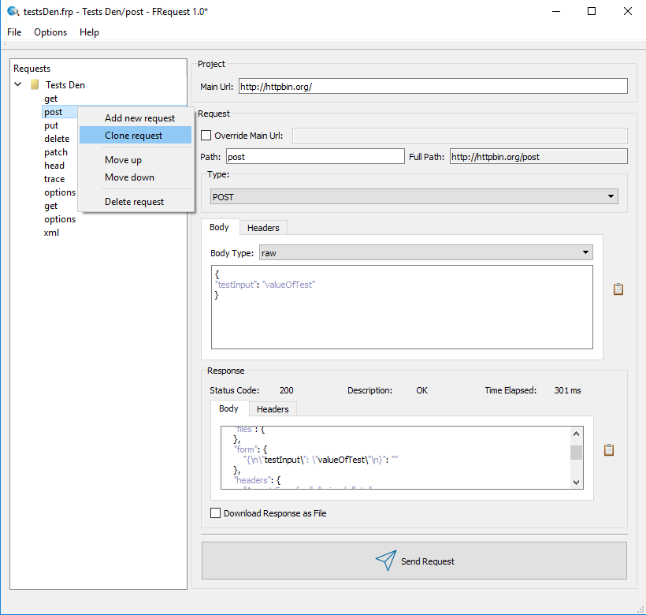
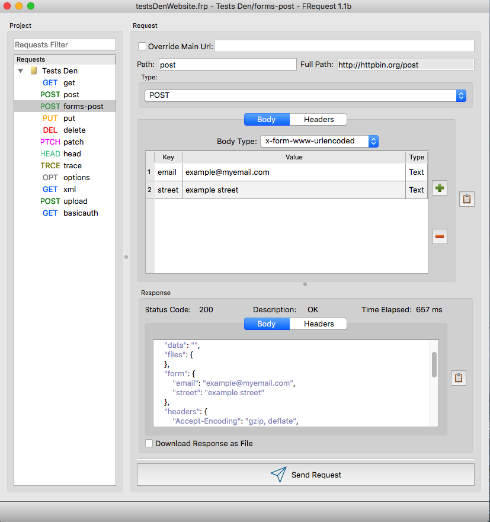
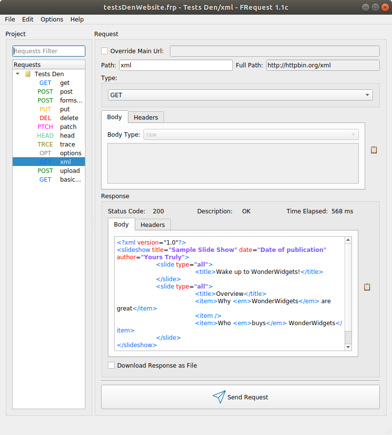
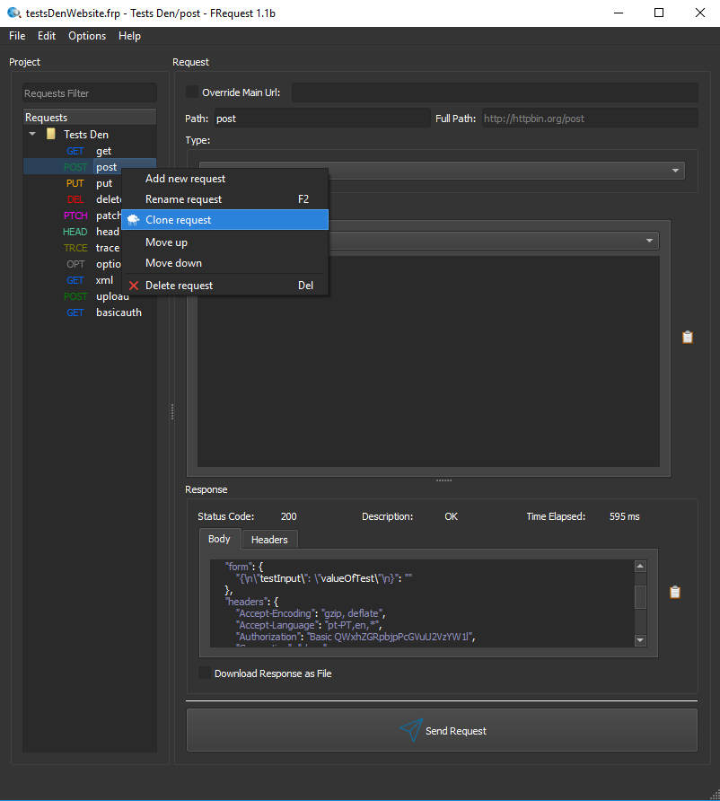
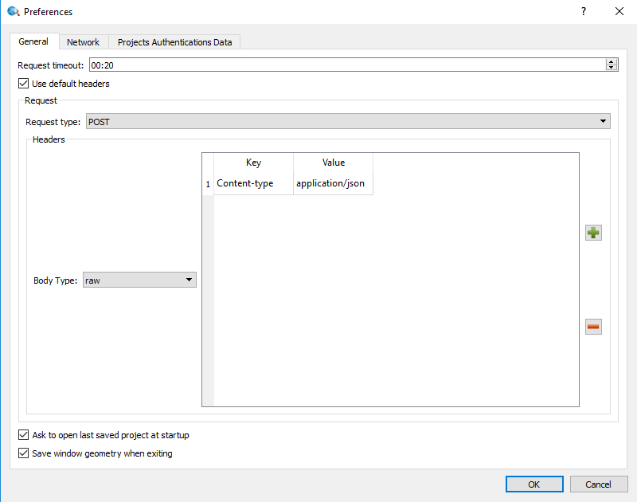
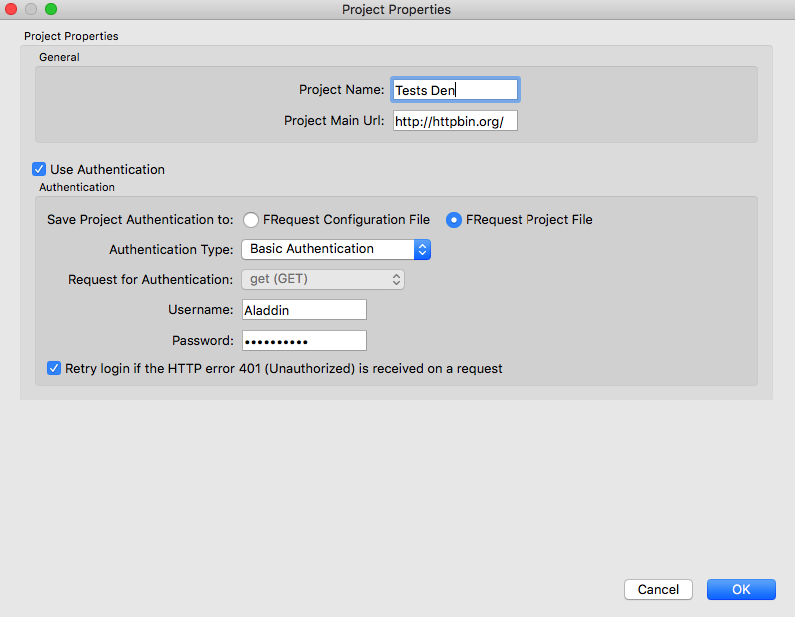

## FRequest 

FRequest is a fast, lightweight and opensource Windows / macOS / Linux desktop program to make HTTP(s) requests (e.g. call REST apis). 

<a href="https://github.com/fabiobento512/FRequest/releases"><b>Download page</b><a/>

FRequest aims to provide a similar interface to an integrated development environment program (IDE) but for HTTP(s) apis. It should be fast, 
cross platform, lightweight, practical with a native look. Also it is important that project files can be 
easily shared and work seamless with Version Control Systems (VCS) for collaborative work.

The current features of FRequest are:

- Make GET / POST / PUT / DELETE / PATCH / HEAD / TRACE / OPTIONS HTTP(s) requests
- Make HTTP requests with RAW / Form Data or X-Form-WWW-UrlEncoded body types
- Send file uploads over the HTTP body type Form Data
- Analyze the requests response body and headers
- Requests are contained in a project, this project is then saved in XML file on user's desired location
- Ability to override a project main url, so you can make requests to different domain name addresses within the same project
- Ability to download files from the requests
- Automatically beautify and apply syntax highlighting for JSON and XML
- Support for authentication (HTTP Basic authentication and Request based authentication) which can be saved either in the program configuration file (for private use) or the project file itself (for shared use)
- The FRequest project files are stored in a way which allow easy collaboration via a VCS like Git, Svn or Team Foundation Server
- Ability to add any kind of custom HTTP headers to the requests (automatically by taking the type in account or adding them manually)
- Network proxy support

FRequest is licensed under GPL 3.0 (https://www.gnu.org/licenses/gpl-3.0.en.html).

### Screenshots
#### Windows main interface

#### macOS main interface

#### Linux main interface

#### Dark Theme

### FRequest preferences interface

### FRequest project properties interface

### Download <a href="https://github.com/fabiobento512/FRequest/releases"><a/>

You can download FRequest for Windows / macOS / Linux <a href="https://github.com/fabiobento512/FRequest/releases">here<a/>.

### Open Source

FRequest is open source, do you want to help? Visit our github page <a href="https://github.com/fabiobento512/FRequest">here<a/>.
